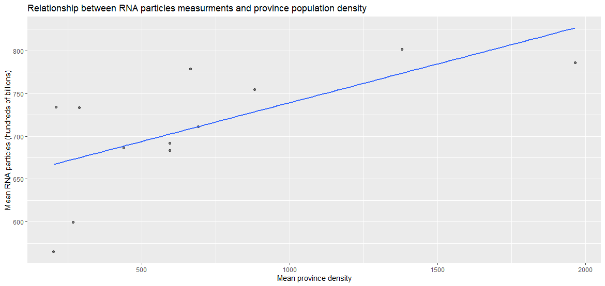
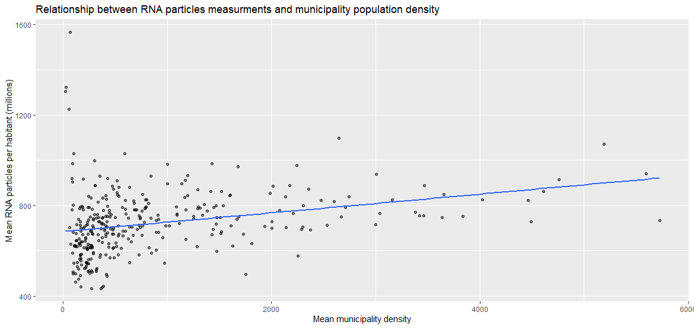
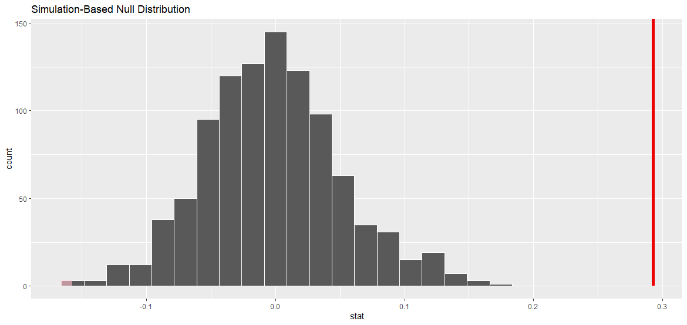

## Preface
<!-- Optional, the preface is not about the subject -->

## Abstract
<!-- Contains the purpose of the research carried out, the research questions that are dealt with, the research method and the most important findings -->

## Table of contents

## Introduction
<!-- An introductory chapter in which the purpose and design of the (sub)study is explained and in which the research questions are described -->

Current research is targeted to explore and analyze statistics data of the ‘Covid-19 National SARS-CoV-2 Wastewater Surveillance’ program carried from September 2020 until December 2023 in order to get insights on how public health in the Netherlands can be improved in relation to Covid-19.

The data analysis in this study will be done through the testing of two hypotheses:

1. Amount of measured SARS-CoV-2 RNA particles is greater in lands with higher population density

    - null hypothesis: weekly mean of RNA flow has no correlation with population density
    - alternative hypothesis: weekly mean of RNA flow has positive correlation with population density

2. Amount of measured SARS-CoV-2 RNA particles is increasing after public holidays

    - null hypothesis: weekly mean of RNA flow is not increasing after public holidays
    - alternative hypothesis: weekly mean of RNA flow is not increasing after public holidays

## Operationalization of the research questions
<!-- Describe the data that will be used and how the questions will be answered on the basis of this data. The data analysis itself is not yet described here. So do tell ‘Data file [X] comes from [Y] and can answer the posed questions because [Z]’, but do not yet describe the data itself -->

## Description of the data used
<!-- Which data/variables were recorded/used for the study, something about any missing values, a graphical representation and summary statistics. Please note that this is about providing insight into the data used, not yet about (the method used for) answering the research questions -->

### Data sources

Data provided as three csv files:

- COVID-19_SewerWaterData_MunicipalitiesWeek.csv with 59,479 observations.
- municipalities_alphabetically_2022.csv with 345 observations.
- Regionale_kerncijfers_Nederland_23012024_192144.csv with 2,908 observations
- public_holidays.csv with 44 observations

Below are descriptions of fields for each data file and indication of the new name (if applicable):

#### Sewer water data

This file contains the average number of SARS-CoV-2 virus particles per 100,000 inhabitants per municipality, per week, as calculated from measurements of the number of virus particles per sewage treatment plant (WWTP).

|Original name|New name|Comment|
|---|---|---|
|Version|-|Version number of the dataset|
|Date_of_report|-|Date on which the file was created|
|Year|-|Year of observation|
|Week|-|Week of the year|
|Start_date|-|Start date of the week|
|End_date|-|End date of the week|
|Region_code|MunicipalityCode|Code of the municipality|
|Region_name|MunicipalityName|Name of the municipality|
|RNA_flow_per_100000_weeklymean|RNA_flow|Number of SARS-CoV-2 RNA particles measured in the sewage, based on a weighted average per 100,000 inhabitants|

#### Municipalities

This file contains information about each municipality's assignment to a province.

|Original name|New name|Comment|
|---|---|---|
|MunicipalCode|-|Code of the municipality|
|MunicipalCodeGM|-|Gemeente code|
|MunicipalName|-|Name of the municipality|
|ProvincialCode|-|Code of the province|
|ProvincialCodePV|-|Province Administrative classification|
|ProvincialName|-|Name of the province|

#### Population density

This file contains population and population density information for each municipality from 2020 to 2023.

|Original name|New name|Comment|
|---|---|---|
|Perioden|Year|Year of observation|
|Regio's|MunicipalName|Name of the municipality|
|Bevolking/Bevolkingssamenstelling op 1 januari/Totale bevolking (ntal)|Population|Total number of inhabitants on Jan. 1|
|Bevolking/Bevolkingssamenstelling op 1 januari/Bevolkingsdichtheid (aantal inwoners per km²)|PopulationDensity|Density of inhabitants per km²|

#### Public holidays

This data set was created manually based on information from https://publicholidays.nl/ for 2020-2023. This data will be used to match weeks in sewer data and mark them whether there was a holiday in during this week or no.

|Original name|New name|Comment|
|---|---|---|
|PublicHoliday|-|Name of holiday|
|Date|-|Date of holiday|

#### Cleaning and combining datasets

Before we proceed to further data manipulation it worth to remove any incomplete observations from sewer and population datasets so these missing values won't have impact on statistics.

**Sewer dataframe unique and missing values**

```R
               unique missing
Version             1       0
Date_of_report      1       0
Year                4       0
Week               53       0
Start_date        172       0
End_date          172       0
Region_code       356       0
MunicipalName     356       0
RNA_flow        51600     918
```

There are 918 missing values of **RNA_flow** feature so these observations are removed from dataset.

**Population dataframe unique and missing values**

```R
                  unique missing
Year                   4       0
MunicipalName        727       0
Population          1388    1514
PopulationDensity    889    1514
```

Respectively, there are 1514 missing values of **Population** and **PopulationDensity** so these observations are subject for removal.

For convenience, information of province name is joined for both sewer and population datasets. 

In addition it worth to normalize **RNA_flow** feature values in for intepretation and visual clarity. Thus, all values **RNA_flow** feature of sewer dataset are divided by 100,000 to have a weekly mean per habitant and then divided by 1,000,000 and further expressed in millions.

Finally, the structure of sewer and population datasets looks as follows:

**Sewer dataframe**

```R
Rows: 58,094
Columns: 8
$ Year           <int> 2020, 2020, 2020, 2020, 2020, 2020, 2020, 2020, 2020, 2020, 2020, 2020,~
$ Week           <int> 37, 37, 37, 37, 37, 37, 37, 37, 37, 37, 37, 37, 37, 37, 37, 37, 37, 37,~
$ Start_date     <chr> "7-9-2020", "7-9-2020", "7-9-2020", "7-9-2020", "7-9-2020", "7-9-2020",~
$ End_date       <chr> "13-9-2020", "13-9-2020", "13-9-2020", "13-9-2020", "13-9-2020", "13-9-~
$ Region_code    <chr> "GM0518", "GM0796", "GM1680", "GM0358", "GM0197", "GM0059", "GM0482", "~
$ MunicipalName  <chr> "'s-Gravenhage", "'s-Hertogenbosch", "Aa en Hunze", "Aalsmeer", "Aalten~
$ RNA_flow       <dbl> 166.932, 59.388, 7.452, 139.167, 19.150, 3.202, 50.272, 150.267, 26.486~
$ ProvincialName <chr> "Zuid-Holland", "Noord-Brabant", "Drenthe", "Noord-Holland", "Gelderlan~
```

**Population dataframe**

```R
Rows: 1,333
Columns: 5
$ Year              <int> 2020, 2020, 2020, 2020, 2020, 2020, 2020, 2020, 2020, 2020, 2020, 20~
$ MunicipalName     <chr> "'s-Hertogenbosch", "Aa en Hunze", "Aalsmeer", "Aalten", "Achtkarspe~
$ Population        <int> 155111, 25445, 31859, 27121, 27843, 20165, 25590, 109436, 73107, 211~
$ PopulationDensity <int> 1410, 92, 1584, 281, 272, 2297, 1180, 991, 1087, 1640, 110, 886, 279~
$ ProvincialName    <chr> "Noord-Brabant", "Drenthe", "Noord-Holland", "Gelderland", "Fryslân~
```

Detalied steps for data preparation and clearing are in project script.

### Data summary statistics

TODO

## Results of the data analysis
<!-- Results of the data analysis: The actual answer of the research questions based on data analysis, the use of specific graphs to gain insight into the answers to the questions and the results of the hypothesis testing -->

### Relation of population density and RNA flow amount

First we will group sewer data and population data by each province following by calculationof mean average for RNA flow amounts:

```R
   ProvincialName mean_RNA mean_desity
   <chr>             <dbl>       <dbl>
 1 Noord-Holland      802.       1379.
 2 Zuid-Holland       786.       1965.
 3 Flevoland          778.        664.
 4 Utrecht            755.        881.
 5 Fryslân           734.        209.
 6 Zeeland            733.        289.
 7 Limburg            711.        690.
 8 Gelderland         692.        595.
 9 Overijssel         686.        440.
10 Noord-Brabant      683.        595.
11 Drenthe            599.        267.
12 Groningen          565.        202
```

Even relationship between these numbers seems legit, there are couple of provinces with relatively low mean density and high mean amount on RNA flow amount at the same time.

Next, we will make a simple scatterplot to get a better understanding of whether there is a any correlation between mean RNA and mean population density in provinces.



Even the that plot gives an impression of high positive correlation, we would like to zoom in at the municipal level for both mean RNA amount and mean population density.

```R
   MunicipalName   mean_RNA mean_desity
   <chr>              <dbl>       <dbl>
 1 Ameland            1567.        65  
 2 Vlieland           1323.        30.2
 3 Schiermonnikoog    1305.        22.8
 4 Terschelling       1227.        57  
 5 Diemen             1097.      2646. 
 6 Amsterdam          1071.      5192. 
 7 Ouder-Amstel       1031.       590. 
 8 Ommen              1029.       102. 
 9 Bergen (NH.)        998.       302. 
10 Dijk en Waard       986.      1428. 
# i 326 more rows
```

Here we can spot some outliers that are municipalities which have low mean population but however have the highest numbers of mean RNA flow amounts.

Nevertheless, on the plot below we can see a relatively positive correlation even with less inclined slope.



Next we will build regression table, based on last aggregate dataframe.

```R
term        estimate std_error statistic p_value lower_ci upper_ci
  <chr>          <dbl>     <dbl>     <dbl>   <dbl>    <dbl>    <dbl>
1 intercept    685.        9.76      70.3        0  666.     705.   
2 mean_desity    0.041     0.007      5.59       0    0.027    0.056
```

Table suggests that for each increase in mean population for municipality, weekly mean of RNA flow amount will be increasing by 41,000 particles per habitant.

Then we make a null distibution to see how current observations fit into the Null Hypothesis:



In this plot, vertical line represent roughly 29.26% of observed correlation assuming the null hypothesis H0 is true.

In other words, we see that the value of the correlation between the mean RNA flow amount and the mean density of municipalities, which we obtained, does not fit the hypothetical null distribution, where the mean RNA flow amount does not correlate with the mean population density in municipalities. Therefore, we are inclined to reject H0 and accept the alternative hypotesis the mean population density indeed have a positive correlation with mean RNA flow amount according to Wastewater Surveillance program.

### Relation of RNA flow amount dynamics during public hoolidays 

## Conclusions and recommendations
<!-- including recommendations for further research -->

## Appendix 1. 