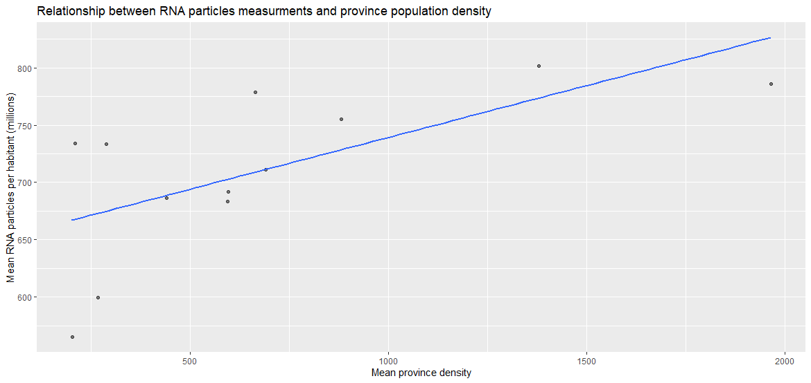

## Preface
<!-- Optional, the preface is not about the subject -->

An analysis of National SARS-CoV-2 Wastewater Surveillance data 

By Itzel Ruiz


A Research Paper
Submitted to the lecturer of the subject ‘Programming with R’
The Hague University of Applied Sciences PRO
Master of Business Administration
MBA Big Data Analytics
January 2024

## Abstract
<!-- Contains the purpose of the research carried out, the research questions that are dealt with, the research method and the most important findings -->

## Table of contents

## Introduction
<!-- An introductory chapter in which the purpose and design of the (sub)study is explained and in which the research questions are described -->

Current research is targeted to explore and analyze statistics data of the ‘Covid-19 National SARS-CoV-2 Wastewater Surveillance’ program carried from September 2020 until December 2023 in order to get insights on how public health in the Netherlands can be improved in relation to Covid-19.

The data analysis in this study will be done through the testing of two hypotheses:

1. Amount of measured SARS-CoV-2 RNA particles is greater in lands with higher population density

    - null hypothesis: weekly mean of RNA flow has no correlation with population density
    - alternative hypothesis: weekly mean of RNA flow has positive correlation with population density

2. Amount of measured SARS-CoV-2 RNA particles is increasing during specific seasons

    - null hypothesis: amount of RNA flow increase observations spread (standard deviation) is not dependent on year season
    - alternative hypothesis: amount of RNA flow increase observations spread (standard deviation) is dependent on year season

## Operationalization of the research questions
<!-- Describe the data that will be used and how the questions will be answered on the basis of this data. The data analysis itself is not yet described here. So do tell ‘Data file [X] comes from [Y] and can answer the posed questions because [Z]’, but do not yet describe the data itself -->

Current research is mainly based on data from The National Institute for Public Health and the Environment (RIVM) which is committed to a healthy population and a sustainable, safe and healthy living environment. 

Source of main dataset is RIVM internet portal (https://data.rivm.nl/covid-19/). Additional dataset with total population and population density for each municipality was taken from open source database of Statistics Netherlands (CBS)  (https://opendata.cbs.nl/#/CBS/nl/dataset/70072ned/table) which provides relevant and independent figures on a wide range of societal issues. 

To operationalize the data in order to formulated research questions are answered the following steps are necessary:

- Import and preparation of data

- Initial exploratory analysis of prepared data

- Provide linear regression models and null hypotheses for each question

These steps make sure the dataset is understandable, cleaned and prepared for exploration so the communication regarding the key results can be done to a broad audience.

### Matching provided data with posed questions

The provided datasets are suitable for conducting statistical analysis to explore the influence of different variables on an increase in virus particles and, consequently, in the dynamics of disease spread and determine if these influences are statistically significant. 

For constructing a linear regression model in line with the research questions, it's vital to select a dependent variable (the outcome) and one or more independent variables (predictors). Mathematically, this is expressed as Y = a + bX, where Y is the dependent variable, X the predictor, a the y-intercept, and b the slope linked to the predictor variable.

#### Does greater density of population correlate with higher amount of measured SARS-CoV-2 RNA particles at the given area?

Since the virus is airborne, it is logical to assume that the dynamics of its spread are related to population density. Thus, the higher the population density in a certain area, the theoretically higher should be the values of SARS-CoV-2 particles in wastewater as measured over time.

In order to answer this question, we aggregate information on measured virus particle values and population density and then use statistical tests to test the relationship between the average number of virus particles in a region and the average density of its population.

- Outcome variable is defined as mean RNA flow over multiple regions over observed period of time.

- Predictor variable is defined as mean population density over multiple regions over observed period of time.

#### Whether relative number of observed increase in RNA particles has seasonal behaviour?

Airborne diseases often show a seasonal pattern due to a combination of factors: environmental conditions like cold, dry air aiding virus stability; increased indoor crowding in colder seasons leading to easier disease transmission; variations in immune system strength influenced by changes in weather and sunlight; and behavioral changes, such as school seasons, affecting how people congregate. Therefore, it is fair to assume that SARS-CoV-2 also has seasonal patterns of distribution.

To investigate this question, we will sort the dataset so that we can label each successive week with a logical variable that reflects the fact of an increase in virus particle counts for each region. Then, we will group the observations by year and week and calculate the number of such increases in RNA flow and the ratio of this number to the total number of observations for all regions for a particular week in a particular year. Finally, we add comparable week numbers to the seasons of the year and calculate the standard deviation (spread) of such cases of RNA flow increase within each season over the observable period.

- Outcome variable is defined as spread of RNA flow increase cases across all regions.

- Predictor variable is defined as season labbel which groups sequence week numbers.

## Description of the data used
<!-- Which data/variables were recorded/used for the study, something about any missing values, a graphical representation and summary statistics. Please note that this is about providing insight into the data used, not yet about (the method used for) answering the research questions -->

### Data sources

Data provided as three csv files:

- COVID-19_SewerWaterData_MunicipalitiesWeek.csv with 59,479 observations.
- municipalities_alphabetically_2022.csv with 345 observations.
- Regionale_kerncijfers_Nederland_23012024_192144.csv with 2,908 observations

Below are descriptions of fields for each data file and indication of the new name (if applicable):

#### Sewer water data

This file contains the average number of SARS-CoV-2 virus particles per 100,000 inhabitants per municipality, per week, as calculated from measurements of the number of virus particles per sewage treatment plant (WWTP).

|Original name|New name|Comment|
|---|---|---|
|Version|-|Version number of the dataset|
|Date_of_report|-|Date on which the file was created|
|Year|-|Year of observation|
|Week|-|Week of the year|
|Start_date|-|Start date of the week|
|End_date|-|End date of the week|
|Region_code|MunicipalityCode|Code of the municipality|
|Region_name|MunicipalityName|Name of the municipality|
|RNA_flow_per_100000_weeklymean|RNA_flow|Number of SARS-CoV-2 RNA particles measured in the sewage, based on a weighted average per 100,000 inhabitants|

Table 1. Sewer dataset description

#### Municipalities

This file contains information about each municipality's assignment to a province.

|Original name|New name|Comment|
|---|---|---|
|MunicipalCode|-|Code of the municipality|
|MunicipalCodeGM|-|Gemeente code|
|MunicipalName|-|Name of the municipality|
|ProvincialCode|-|Code of the province|
|ProvincialCodePV|-|Province Administrative classification|
|ProvincialName|-|Name of the province|

Table 2. Municipalities dataset description

#### Population density

This file contains population and population density information for each municipality from 2020 to 2023.

|Original name|New name|Comment|
|---|---|---|
|Perioden|Year|Year of observation|
|Regio's|MunicipalName|Name of the municipality|
|Bevolking/Bevolkingssamenstelling op 1 januari/Totale bevolking (ntal)|Population|Total number of inhabitants on Jan. 1|
|Bevolking/Bevolkingssamenstelling op 1 januari/Bevolkingsdichtheid (aantal inwoners per km²)|PopulationDensity|Density of inhabitants per km²|

Table 3. Population dataset description

#### Cleaning and combining datasets

Before we proceed to further data manipulation it worth to remove any incomplete observations from sewer and population datasets so these missing values won't have impact on statistics.

**Sewer dataframe unique and missing values**

```R
               unique missing
Version             1       0
Date_of_report      1       0
Year                4       0
Week               53       0
Start_date        172       0
End_date          172       0
Region_code       356       0
MunicipalName     356       0
RNA_flow        51600     918
```
Snippet 1. Unique and missing values in sewer dataframe

There are 918 missing values of **RNA_flow** feature so these observations are removed from dataset.

**Population dataframe unique and missing values**

```R
                  unique missing
Year                   4       0
MunicipalName        727       0
Population          1388    1514
PopulationDensity    889    1514
```
Snippet 2. Unique and missing values in population dataframe

Respectively, there are 1514 missing values of **Population** and **PopulationDensity** so these observations are subject for removal.

For convenience, information of province name is joined for both sewer and population datasets. 

In addition it worth to normalize **RNA_flow** feature values in for intepretation and visual clarity. Thus, all values **RNA_flow** feature of sewer dataset are divided by 100,000 to have a weekly mean per habitant and then divided by 1,000,000 and further expressed in millions.

Finally, the structure of sewer and population datasets looks as follows:

**Sewer dataframe**

```R
Rows: 58,094
Columns: 8
$ Year           <int> 2020, 2020, 2020, 2020, 2020, 2020, 2020, 2020, 2020, 2020, 2020, 2020,~
$ Week           <int> 37, 37, 37, 37, 37, 37, 37, 37, 37, 37, 37, 37, 37, 37, 37, 37, 37, 37,~
$ Start_date     <chr> "7-9-2020", "7-9-2020", "7-9-2020", "7-9-2020", "7-9-2020", "7-9-2020",~
$ End_date       <chr> "13-9-2020", "13-9-2020", "13-9-2020", "13-9-2020", "13-9-2020", "13-9-~
$ Region_code    <chr> "GM0518", "GM0796", "GM1680", "GM0358", "GM0197", "GM0059", "GM0482", "~
$ MunicipalName  <chr> "'s-Gravenhage", "'s-Hertogenbosch", "Aa en Hunze", "Aalsmeer", "Aalten~
$ RNA_flow       <dbl> 166.932, 59.388, 7.452, 139.167, 19.150, 3.202, 50.272, 150.267, 26.486~
$ ProvincialName <chr> "Zuid-Holland", "Noord-Brabant", "Drenthe", "Noord-Holland", "Gelderlan~
```
Snippet 3. Structure of sewer dataframe

**Population dataframe**

```R
Rows: 1,333
Columns: 5
$ Year              <int> 2020, 2020, 2020, 2020, 2020, 2020, 2020, 2020, 2020, 2020, 2020, 20~
$ MunicipalName     <chr> "'s-Hertogenbosch", "Aa en Hunze", "Aalsmeer", "Aalten", "Achtkarspe~
$ Population        <int> 155111, 25445, 31859, 27121, 27843, 20165, 25590, 109436, 73107, 211~
$ PopulationDensity <int> 1410, 92, 1584, 281, 272, 2297, 1180, 991, 1087, 1640, 110, 886, 279~
$ ProvincialName    <chr> "Noord-Brabant", "Drenthe", "Noord-Holland", "Gelderland", "Fryslan~
```
Snippet 4. Structure of population dataframe

Detalied steps for data preparation and clearing are in project script.

### Exploring data summary 

To begin with exploration, first we will take a look on how many municipalities each province have.


Graph 1. Number of municipalities number in each province

Next we will take a look at how population summary corresponds to population density.


Graph 2. Population size vs. density

Here we can notice that there is a cluster of data points at the lower end of both axes, indicating that many areas have small populations and low population density. As the population size increases, the population density does not necessarily increase proportionally. This suggests that larger populations are spread over larger areas in some cases.

There are outliers with high population density and smaller population size, as well as areas with large populations and comparatively lower density. The lack of a clear, strong pattern might indicate a complex relationship between the size of a population and how densely it is distributed, potentially influenced by geographical and socio-economic factors.

Next we will visualize the distribution of population sizes across provinces (cutting down outliers with population more than 250,000). 


Graph 3. Summary for population sizes for provinces

The median population size varies between provinces, with some having higher medians, indicating larger central tendencies of population. Provinces like Noord-Holland and Zuid-Holland show wider interquartile ranges, suggesting more variability in municipality sizes.

Several provinces exhibit outliers, suggesting the presence of municipalities with populations significantly different from others within the same province. The differences in box heights and positions across provinces suggest disparities in population distributions across municipalities.

We also would like to summarize distribution of population density across provinces the same way.


Graph 4. Summary for population density for provinces

There's a wide range in population density among provinces, with some provinces having significantly higher median population densities than others. Zuid-Holland stands out with a much higher median and variation in population density, suggesting it has more urbanized areas compared to other provinces.

Most provinces have outliers indicating municipalities with extremely high population density compared to their respective provincial medians. The spread of the boxes and whiskers shows that the distribution of population density is not uniform across provinces, reflecting differences in urbanization, geography, and settlement patterns.

It can be concluded that provinces with larger populations do not necessarily have higher densities. For example, while Zuid-Holland has a high population density, its population size is not proportionally larger than some other provinces. This suggests that factors other than sheer population numbers, such as geographical size and urban planning, significantly influence population density. Provinces with high variability in population size do not always show the same variability in density, indicating that some less populated areas can be quite densely populated, likely due to urbanization.

In addition we would like also plot a histogram with general population distribution across municipalities.


Graph 5. Histogram for population distribution

It shows that the majority of municipalities have relatively small populations, with a sharp peak at the lower end of the population range. This indicates that smaller municipalities are more common than larger ones. The distribution is right-skewed, with fewer municipalities having very large populations, as seen in the long tail stretching to the right. This suggests a pattern where a few municipalities have large populations while the vast majority have smaller populations.

Finally we would like to depict the trend of SARS-CoV-2 RNA particles measured in sewage over time.


Graph 6. RNA flow measurments over time

It shows clear fluctuations in concentration levels, with multiple peaks suggesting waves or surges in COVID-19 cases. The x-axis indicates the time in year-week format, revealing periods with increased RNA particle counts which may correspond to outbreaks or increases in infection rates. The sharp rise towards the right end of the graph could indicate a recent and significant surge, possibly due to a new variant or reduced adherence to public health measures. 

## Results of the data analysis
<!-- Results of the data analysis: The actual answer of the research questions based on data analysis, the use of specific graphs to gain insight into the answers to the questions and the results of the hypothesis testing -->

### Relation of population density and RNA flow amount

First we will group sewer data and population data by each province following by calculation of mean average for RNA flow amounts:

```R
   ProvincialName mean_RNA mean_desity
   <chr>             <dbl>       <dbl>
 1 Noord-Holland      802.       1379.
 2 Zuid-Holland       786.       1965.
 3 Flevoland          778.        664.
 4 Utrecht            755.        881.
 5 Fryslan           734.        209.
 6 Zeeland            733.        289.
 7 Limburg            711.        690.
 8 Gelderland         692.        595.
 9 Overijssel         686.        440.
10 Noord-Brabant      683.        595.
11 Drenthe            599.        267.
12 Groningen          565.        202
```
Snippet 5. Mean RNA flow and mean density per province

Even relationship between these numbers seems legit, there are couple of provinces with relatively low mean density and high mean amount on RNA flow amount at the same time.

Next, we will make a simple scatterplot to get a better understanding of whether there is a any correlation between mean RNA and mean population density in provinces.


Graph 7. Relation between mean RNA flow and mean population density per province

Even the that plot gives an impression of high positive correlation, we would like to zoom in at the municipal level for both mean RNA amount and mean population density.

```R
   MunicipalName   mean_RNA mean_desity
   <chr>              <dbl>       <dbl>
 1 Ameland            1567.        65  
 2 Vlieland           1323.        30.2
 3 Schiermonnikoog    1305.        22.8
 4 Terschelling       1227.        57  
 5 Diemen             1097.      2646. 
 6 Amsterdam          1071.      5192. 
 7 Ouder-Amstel       1031.       590. 
 8 Ommen              1029.       102. 
 9 Bergen (NH.)        998.       302. 
10 Dijk en Waard       986.      1428. 
# i 326 more rows
```
Snippet 6. Mean RNA flow and mean density per municipality

Here we can spot some outliers that are municipalities which have low mean population but however have the highest numbers of mean RNA flow amounts.

Nevertheless, on the plot below we can see a relatively positive correlation even with less inclined slope.


Graph 8. Relation between mean RNA flow and mean population density per municipality

Next we will build regression table, based on last aggregate dataframe.

```R
term        estimate std_error statistic p_value lower_ci upper_ci
  <chr>          <dbl>     <dbl>     <dbl>   <dbl>    <dbl>    <dbl>
1 intercept    685.        9.76      70.3        0  666.     705.   
2 mean_desity    0.041     0.007      5.59       0    0.027    0.056
```
Snippet 7. Regression table for first hypotesis

Table suggests that for each increase in mean population for municipality, weekly mean of RNA flow amount will be increasing by 41,000 particles per habitant.

Then we make a null distibution to see how current observations fit into the Null Hypothesis:


Graph 9. Null distribution for first hypotesis

In this plot, vertical line represent observed statisic of 0.293 assuming the null hypothesis H0 is true.

In other words, we see that the value of the correlation between the mean RNA flow amount and the mean density of municipalities, which we obtained, does not fit the hypothetical null distribution, where the mean RNA flow amount does not correlate with the mean population density in municipalities. Therefore, we are inclined to reject H0 and accept the alternative hypotesis the mean population density indeed have a positive correlation with mean RNA flow amount according to Wastewater Surveillance program.

### Relation of RNA flow amount dynamics to seasons

First we have to set borders for seasons for clarity:

|Season|Start week|End week|
|---|---|---|
|Winter|49|09|
|Sring|10|22|
|Summer|23|35|
|Fall|36|48|

Table 4. Mapping of week numbers with seasons

In order to add more clarity to plots, last winter weeks of the year were shifted leftward from zero and assigned to the next year, so that e.g. weeks 52, 51, 50 and 49 of 2020 became weeks -1, -2, -3 and -4 of 2021 respectively, etc.

Additionaly we went over sewer data set and added `IncreaseRNA` feature which shows whether there was an increase in RNA flow comparing with previous week (for each municipality).

Next we would like to plot a percentage of increase observations (devided by total number of observations for each week) for each week faceted by each year to spot any seasonal pattern in RNA increase.


Graph 10. Faceted distribution of RNA flow increase ratio

From the plot it's not evident that there is a specific seasonal pattern. So next we will flatten these facets and apply liniar model to have an idea of overall correlation of increase cases throughout the year.


Graph 11. Flat distribution of RNA flow increase ratio

Form this plot it's also not evident that there is any strong correlation over the whole year, so next we will explore a linear model for each season.


Graph 12. Flat distribution of RNA flow increase ratio faceted with seasons

Linear model for each season also shows either no or slighly negative correlation. We can flatten this graph even more to see that there is a significant spread of increase cases inside each season during observation years.


Graph 13. Flat distribution of RNA flow increase ratio

Next we will build regression table, to see how spread of increse cases (standard deviation) depends on season.

```R
 term       estimate std_error statistic p_value lower_ci upper_ci
  <chr>         <dbl>     <dbl>     <dbl>   <dbl>    <dbl>    <dbl>
1 intercept     0.435     0.011     38.2    0        0.413    0.458
2 season_num    0.005     0.004      1.19   0.236   -0.003    0.013
```
Snippet 8. Regression table for second hypotesis

Table suggests that for each next season there will be roughly 0,5% more spread of increase cases on avarage across all municipalities.

Then we make a null distibution to see how current observations fit into the Null Hypothesis:


Graph 14. Null distribution for second hypotesis

In this plot, vertical line represent observed correlation of 0.0911 assuming the null hypothesis H0 is true.

In other words, observed value is somewhat fit the null distribution and therefore we can say that spread of increase cases of RNA flow is not significantly depends on year season. Therefore, we are inclined to accept H0 and reject the alternative hypotesis that increase of RNA flow has low spread during specific season.

## Conclusions and recommendations
<!-- including recommendations for further research -->

## Appendix 1. 